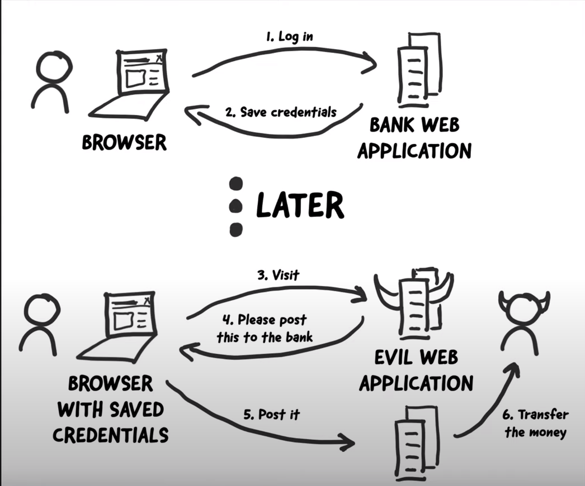

Методы защиты от CSRF-атаки
============================

Что такое CSRF атака?
---------------------

CSRF-атаки основаны на том, что браузеры не понимают, как различить, было ли действие явно совершено пользователем (как, скажем, нажатие кнопки на форме или переход по ссылке) или пользователь неумышленно выполнил это действие (например, при посещении evil.com, ресурсом был отправлен запрос на good.com/some_action, в то время как пользователь уже был залогинен на good.com). Атаки происходят, когда злоумышленник отправляет поддельный запрос от имени авторизованного пользователя, используя его сеансовую информацию. Это позволяет злоумышленнику выполнить определенные действия от имени пользователя без его согласия.

Последствия CSRF-атак могут быть серьезными и варьируются в зависимости от конкретного случая. Они могут включать в себя потерю конфиденциальных  данных, финансовые потери, кража аккаунтов, публикация фишинговых или непотребных сообщений, ущерб репутации владельца веб-сайта и потерю доверия пользователей.

Механизм работы CSRF атак
---------------------



1. Пользователь авторизуется на веб-сайте.
2. Сервер отправляет данные для идентификации пользователя в cookie, которые сохраняются в браузере клиента.

    Хоть куки могут быть доступны только для веб-сайта, который их создал, так как браузеры обеспечивают изоляцию куков между различными доменами, чтобы предотвратить несанкционированный доступ к данным. Но хакеры пользуются тем, что после сохранения cookies, браузер автоматически добавляет их к каждому запросу на сервер, не зависимо от домена отправки запроса.
3. Злоумышленник отправляет ссылку на свой сайт по почте или размещает на форуме. И по ней переходит жертва.
4. На сайте злоумышленника находится форма, которая формирует запрос для выполнения нежелательных действий, таких как перевод денег.
5. Запрос автоматически отправляется, прикрепляя cookie жертвы.
6. На сервере успешно проходит аутентификация, так как в cookie хранится идентификатор пользователя. В итоге запрос выполняется и жертва теряет деньги.

Пример сайта хакера:

``` html
<html>
    <body>
        <form action="https://example.com/user/getmoney" method="POST">
            <input type="hidden" name="city" value="Moscow" />
            <input type="hidden" name="street" value="Prospekt&#32;Mira" />
            <input type="hidden" name="zip" value="12345">
            <input type="submit" value="Submit request" />
        </form>
        <script>
            document.forms[0].submit();
        </script>
    </body>
</html>
```

Или так

``` html
<script>
    let request = new XMLHttpRequest();
    let data = 'city=Moscow&street=Prosperkt+Mira&zip=12345';
    request.open('POST','https://example.com/user/getmoney', true); 
    request.withCredentials = true; // INCLUDE COOKIES
    request.setRequestHeader("Content-type", "application/x-www-form-urlencoded");
    request.send(data);
</script>
```

Такие страницы отрисовываются очень быстро, и пользователь может и не заметить, что посетил сайт хакера, и в итоге окажется на сайте банка.

Как от нее защититься?
-----------------------

Эффективным и общепринятым на сегодня способом защиты от CSRF-Атаки является токен. Под токеном имеется в виду случайный набор байт, который сервер передает клиенту, а клиент возвращает серверу.

Защита сводится к проверке токена, который сгенерировал сервер, и токена, который прислал пользователь.

Если вы пишете свой Web-сервис в соответствии со стандартом REST, то методы GET, HEAD, OPTIONS и TRACE являются безопасными: они предназначены только для получения информации и не должны изменять состояние сервера.

Таким образом, защищать необходимо небезопасные методы, к которым относятся: POST, PUT, DELETE, PATCH.

Требования к токену
--------------------

- Уникальный токен для каждой операции
- Действует единожды
- Имеет размер, устойчивый к подбору
- Сгенерирован криптографически стойким генератором псевдослучайных чисел
- Имеет ограниченное время жизни

Требования к Web-Сервису и окружению
--------------------------------------

- Отсутствие XSS уязвимостей.
Внедренный злоумышленником скрипт имеет возможность отправлять запрос к серверу от имени пользователя и читать его без каких-либо препятствий. Таким образом, XSS уязвимости могут быть использованы для получения текущего токена.

- Отсутствие удаленного доступа у хакера к машине клиента.
Если злоумышленник имеет возможность запускать софт на машине клиента, то он может получить любые данные, имеющиеся в браузере.

Методы защиты
--------------

Существует 3 основных метода использования токенов для защиты web-сервисов от CSRF атак:

1. CSRF Token (Statefull)
2. Double Submit Cookie (Stateless)
3. Encrypted Token (Stateless)

CSRF Token
-------------------

Простой подход, использующийся повсеместно. Требует хранения токена на стороне сервера.

Суть подхода заключается в следующем:

1. При старте сессии на стороне сервера генерируется уникальный токен.
2. Токен сохраняется на стороне сервера в хранилище данных сессии для последующей проверки.
3. В ответ на запрос, который стартовал сессию, сервер возвращает токен клиенту.

    Если рендеринг происходит на сервере, токен может быть включен в HTML-код, например, внутри поля формы или внутри тега.

    Если ответ возвращается для JS-приложения, токен может быть передан в заголовке запроса (часто используется заголовок X-CSRF-Token).
4. При последующих запросах клиент обязан передавать токен серверу для проверки.

    При рендеринге контента сервером токен принято возвращать внутри POST-данных формы.

    JS-приложения обычно отправляют XHR-запросы с заголовком (X-CSRF-Token), содержащим токен.
5. При получении запроса с использованием небезопасного метода (POST, PUT, DELETE, PATCH), сервер обязан проверить идентичность токена из данных сессии и токена, который прислал клиент.
6. Если оба токена совпадают, то запрос считается безопасным, в противном случае - событие логируется и запрос отклоняется.
7. Так как атакующий не знает токен, то классическая CSRF-атака не работает.

Преимущества использования CSRF-токена:

- Защита от CSRF-атак на хорошем уровне.
- Токен обновляется только при пересоздании сессии, что происходит при истечении срока действия сессии.
- В течение одной сессии все действия проверяются с использованием одного токена.
- В случае утечки токена, злоумышленник сможет выполнить CSRF-атаку только на запросы в течение ограниченного времени.
- Токен не инвалидируется после выполнения запроса, что позволяет разработчику не заботиться о синхронизации токена в разных табах браузера, так как токен всегда один.

Double Submit Cookie
--------------------

Этот подход, известный как Double Submit Cookie, предлагает решение без хранения данных на стороне сервера и является Stateless. Он особенно полезен, если вы хотите масштабировать свой веб-сервис горизонтально с высокой производительностью.

Идея заключается в том, чтобы передать токен клиенту двумя способами: в виде cookie и в одном из параметров ответа (header или внутри HTML).

Вот как это работает:

1. При запросе от клиента на стороне сервера генерируется токен. Затем этот токен возвращается клиенту в виде cookie (например, X-CSRF-Token) и в одном из параметров ответа (в заголовке или внутри HTML).
2. В последующих запросах клиент должен предоставить оба ранее полученных токена: один в виде cookie, а другой либо в заголовке запроса, либо внутри POST-данных формы.
3. При получении запроса с использованием небезопасного метода (POST, PUT, DELETE, PATCH), сервер обязан проверить идентичность токена из cookie и явно переданного токена клиентом.
4. Если оба токена совпадают, то запрос считается безопасным и не подвергся CSRF-атаке. В противном случае, событие логируется и запрос отклоняется.
5. Так как атакующий просто так не может изменить куки в браузере пользователя, то классическая CSRF-атака не работает.

Преимущества использования Double Submit Cookie:

- Stateless защита от CSRF-атак.
- Важно учитывать, что поддомены могут читать cookie основного домена, если это не запрещено (например, если cookie установлена на .site.ru, то ее можно прочитать как a.site.ru, так и b.site.ru).
- Если ваш сервис доступен на домене третьего уровня, а злоумышленник может зарегистрировать свой ресурс на вашем домене второго уровня, рекомендуется явно устанавливать cookie для вашего домена.

Encrypted Token
---------------

Подход Encrypted Token, так же как и Double Submit, является Stateless. Основная идея заключается в том, что если вы зашифруете данные надежным алгоритмом и передадите их клиенту, то клиент не сможет их подделать без знания ключа. В отличие от Double Submit, этот подход не требует использования cookie. Токен передается клиенту только в параметрах ответа.

В данном подходе токеном являются зашифрованные факты, необходимые для валидации токена в дальнейшем. Минимально необходимые факты включают идентификатор пользователя и временную метку генерации токена. Ключ шифрования не должен быть известен клиенту.

Вот как это работает:

1. При запросе от клиента на стороне сервера генерируется токен.
2. Генерация токена состоит в зашифровке необходимых фактов для валидации токена.
3. Минимально необходимые факты включают идентификатор пользователя и временную метку. Токен возвращается клиенту в одном из параметров ответа (в заголовке или внутри HTML).
4. В последующих запросах клиент обязан предоставлять ранее полученный токен.
5. При получении запроса с использованием небезопасного метода (POST, PUT, DELETE, PATCH), сервер обязан валидировать токен, полученный от клиента.
6. Валидация токена заключается в его расшифровке и сравнении фактов, полученных после расшифровки, с реальными данными. (Проверка временной метки необходима для ограничения времени жизни токена).
7. Если расшифровка не удалась или факты не совпадают, считается, что запрос подвергся CSRF-атаке.

Преимущества использования Encrypted Token:

- Stateless защита от CSRF-атак.
- Нет необходимости хранить данные в cookie.
- Отсутствуют нюансы с поддоменами.

Same Site
---------

SameSite Cookies - это механизм, который позволяет браузерам и владельцам сайтов ограничить, какие межсайтовые запросы, если таковые имеются, должны включать определённые файлы cookie. Так как браузер не отправляет куки, если запрос осуществляется с другого домена, например, с сайта атакующего. Таким образом это опять защищает от классической CSRF-атаки.

Работа SameSite Cookies:

SameSite Cookies имеют три возможных значения: "Strict", "Lax" и "None":

- Strict: Куки с SameSite=Strict не будут отправляться при переходе на другой сайт. Они будут отправляться только при запросах, инициированных самим сайтом, на котором они были установлены.
- Lax: Куки с SameSite=Lax будут отправляться при переходе на другой сайт только в случае:

    - В запросе используется метод GET
  
    - Запрос является результатом навигации пользователя по верхнему уровню, например, перехода по ссылке.
- None: Куки с SameSite=None будут отправляться при любом переходе на другой сайт, включая запросы, инициированные другими сайтами.

Недостатки SameSite Cookies:

- Ограничения взаимодействия с другими сайтами: Использование SameSite Cookies может привести к ограничениям взаимодействия с другими сайтами, особенно при использовании "Strict" или "Lax" значений. Это может вызывать проблемы с функциональностью, такой как вход через сторонние сервисы.
- Совместимость с более старыми браузерами: Некоторые старые браузеры не поддерживают SameSite Cookies, что может вызывать проблемы совместимости при разработке.
- Нет стандарта: разные браузеры могут иметь различные реализации для значений SameSite, таких как "Strict" и "Lax". Это может привести к непредсказуемому поведению и различиям в работе SameSite Cookies в разных браузерах.

В целом, SameSite Cookies являются полезным механизмом для повышения безопасности веб-приложений, но требуют внимательного рассмотрения при выборе значения SameSite и учета возможных ограничений и совместимости.

Рекомендации
---------------------

- Токены — обязательная защита от CSRF.
- Проверяйте, но не полагайтесь только на X-Requested-With: XMLHttpRequest.
- Проверяйте, но не полагайтесь только на заголовки: Host, Origin, Referer.
- Не передавайте токены в URL.
- Защищайте все запросы.
- Ограничиваем время жизни cookie, которое содержит токен, разумным значением. Например 30 минут.
- Делаем cookie недоступной из JS (ставим HTTPOnly=true).
- Размер токена не менее 32 байт.
- Комбинируйте различные CSRF-защиты.
- Спрашивайте у пользователя пароль для выполнения критичных действий.
